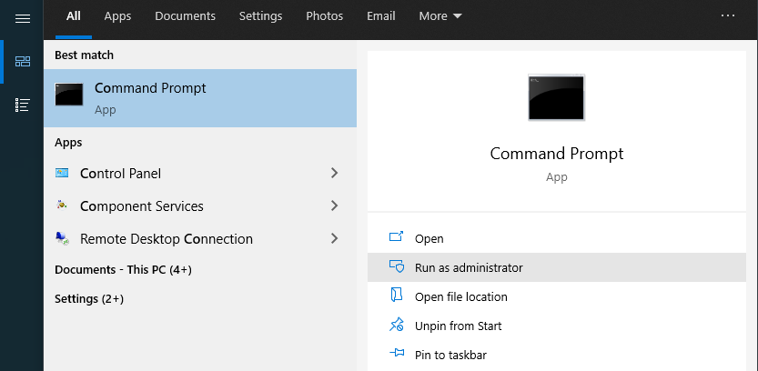
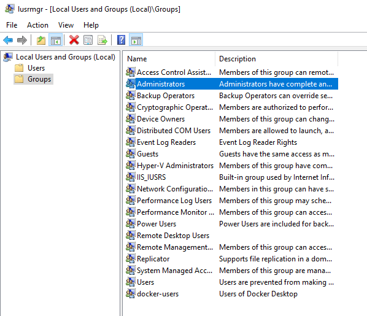

# Local Admin rights for a user

Sometimes you want to make some user admin rights.

Be aware that there is not "the one" admin right in windows, especially if you work for a company. But I won't the discuss the tree-like structure here. I will only show you how to set local admin rights for a user. 

## If you have full access

How to change a local user account to an administrator account if it's really _your_ computer. (Source: [microsoft.com](https://support.microsoft.com/en-us/windows/create-a-local-user-or-administrator-account-in-windows-20de74e0-ac7f-3502-a866-32915af2a34d#WindowsVersion=Windows_10))

1. Select **Start**  >**Settings**  > **Accounts** .
2. Under **Family & other users**, select the account owner name (you should see "Local Account" below the name), then select **Change account type**.  
_Note_: If you choose an account that shows an email address or doesn't say "Local account", then you're giving administrator permissions to a Microsoft account, not a local account.
3. Under **Account type**, select **Administrator**, and then select **OK**.
4. Sign in with the new administrator account.

## If you have limited access 

If you are on your working laptop, you are limited in most cases so you can't work on your profile directly. In that case, you might want to add the user to the admin-group.

_Note_: If you do this, you might end up to type in your password more often.
**You need any account with local admin rights to follow the next steps.** 

1. Open a Command Prompt (or Power Shell) with admin rights.  E.g. go press the "Windows-Key" (or click the logo in the left lower corner), look for "Command Prompt" and click "Run as administrator".  
2. A dialogue will appear. Use the credentials of your admin account.
3. Open Lusrmgr by execution `lusrmgr.msc` in the upcomming terminal. 
4. A window will open. Go to **Groups**, double click on "Administrators" 
5. Click "Add..." and add your standard account (type your email-adress, click "Check Name", click "ok" and "ok" again to close the group). Do the same with group "Users". (No picture here, you will figure it out.)