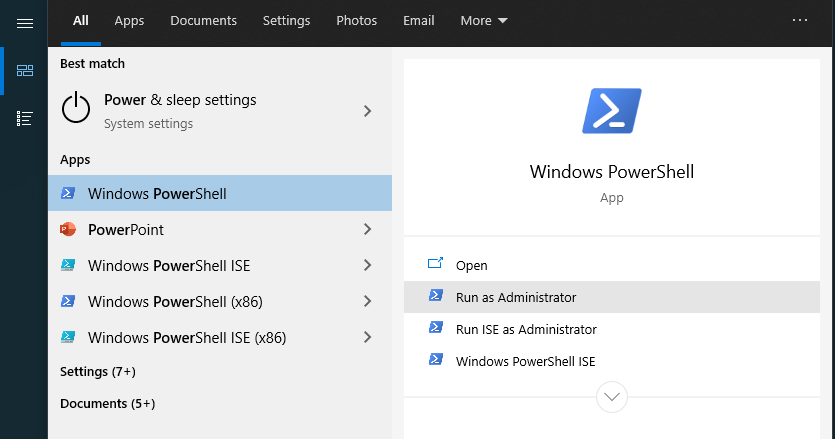

# Enable  Windows Subsystem 2 for Linux

Sometimes you need to do Linux stuff on your windows computer.

Of course it is always an option to run a docker container, mounting volumes, creating your own subsystem etc.
But it is much easier to enable Windows Subsystem 2 for Linux. 

Thanks to [Martin Berger](https://www.martinberger.com/2020/09/windows-10-wsl-2-docker-and-oracle-a-perfect-partnership/).

## Step 1:
Open a Power Shell with admin rights.  E.g. go press the "Windows-Key" (or click the logo in the left lower corner), look for "Command Prompt" and click "Run as administrator"

## Step 2:
Run

> dism.exe /online /enable-feature /featurename:Microsoft-Windows-Subsystem-Linux /all /norestart

That's it. Well done.
- You can execute Linux commands now while using Powershell (not Command Prompt).
- You don't need to restart.
- You may also execute .sh - Scripts (executing them from Powershell).
- The change is permanent, so you don't need to do this step after each restart.
